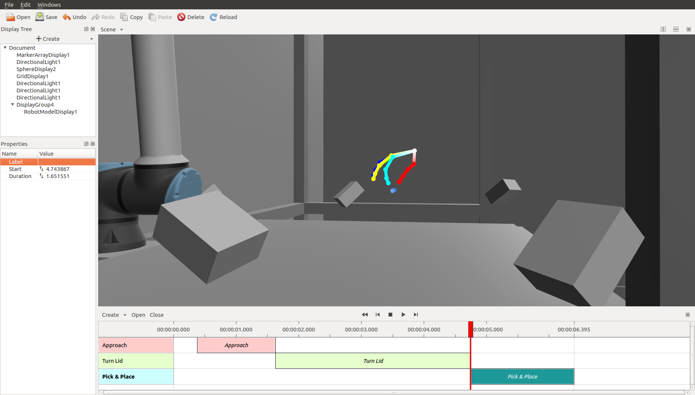
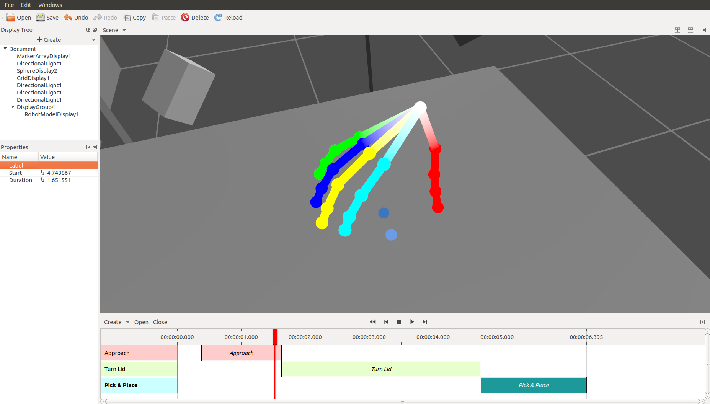

# Visualization and annotation tool for robotics

### Features

- Visualizing robots and robot trajectories
- Annotating rosbags, annotating images
- Undo/redo
- Visualization markers, interactive markers
- Creating interactive markers without writing code
- Loading and playing rosbags
- Seeking in rosbags with multiple TF publishers, without breaking TF
- Online visualization
- Plots, filtering plot data, message queries
- Physically-based shading
- Transparency without order inversion
- Options to fix mesh normals
- Normal mapping
- Multi-threaded architecture, renderer can't freeze GUI
- Asynchronous loading, asynchronous rendering

### Screenshots

