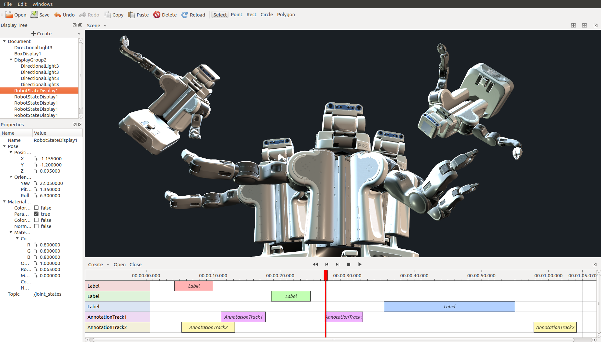
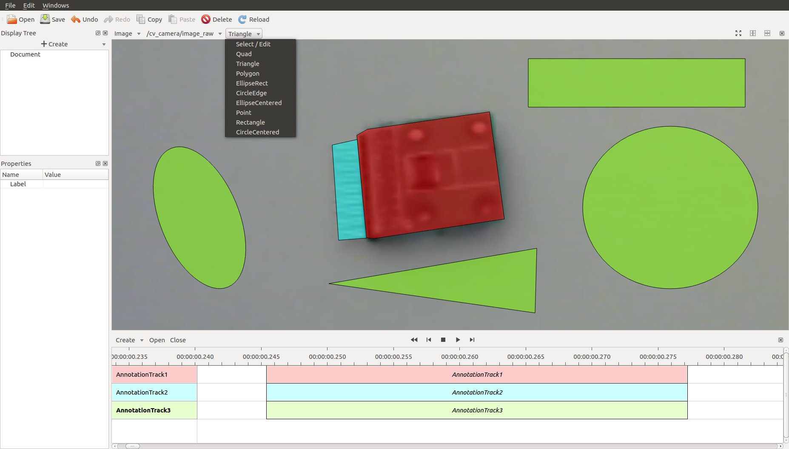
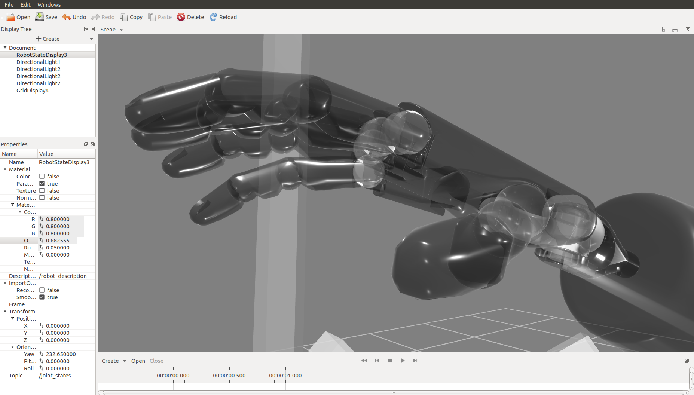
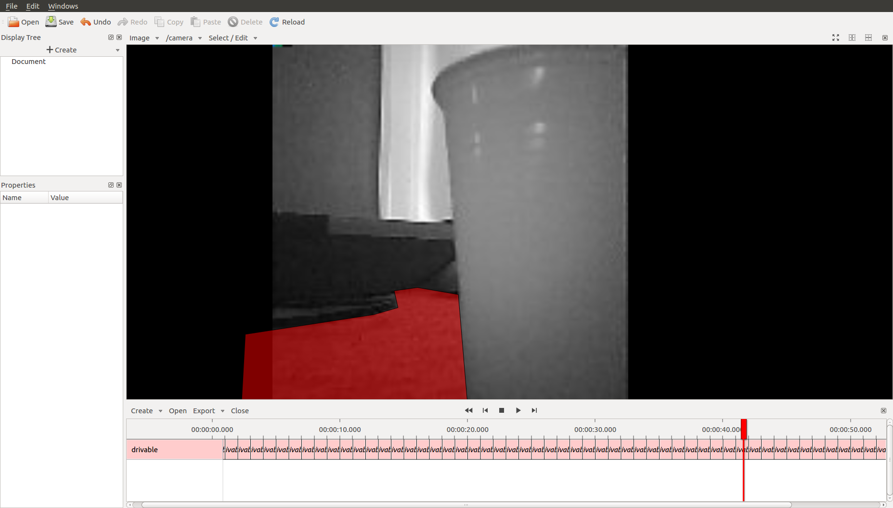
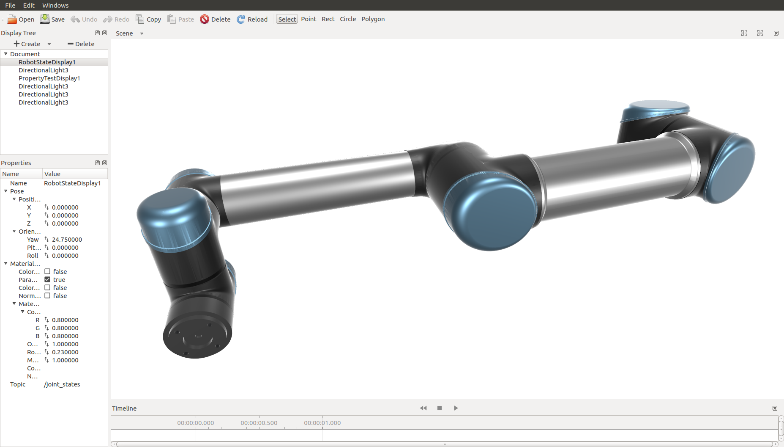

# TAMSVIZ - Visualization and Annotation Tool for ROS

### Features

- Visualize robots and robot trajectories
- Visualize rosbags
- Annotate rosbags
- Annotate images
- Undo/redo
- Visualization markers, interactive markers
- Creating interactive markers without writing code
- Loading and playing rosbags
- Seeking in rosbags with multiple TF publishers, without breaking TF
- Online visualization
- Plots, filtering plot data, message queries
- Physically-based shading
- Dynamic lighting and shadows
- Transparency without order inversion
- Options to fix mesh normals
- Normal mapping
- Multi-threaded architecture, renderer can't freeze GUI
- Asynchronous loading, asynchronous rendering
- High-quality text rendering
- Anti-aliasing
- ROS integration
- Mouse picking

### Screenshots

### Documentation

https://tams-group.github.io/tamsviz/
